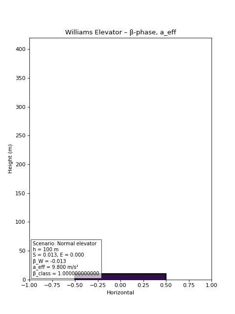

# Williams Framework — Structural Media Simulator

> **A new geometric framework that reveals structural phases in physical systems that classical physics cannot see.**

---

## The Problem with Classical Physics

Classical mechanics has one answer for β regardless of the system's geometry, energy structure, or internal dynamics:

```
β_class ≈ 1.000000000000
```

Always. No matter what.

---

## What the Williams Framework Finds

The Williams structural parameter β_W captures what classical physics misses entirely — the geometric and energetic state of the system as it actually behaves.

Across four test scenarios on the same physical system:

| Scenario | β_W | Felt Gravity | β_class |
|----------|-----|-------------|---------|
| Standard | -0.013 | 1.000 g | ≈1.000 |
| High energy | -5.000 | 1.000 g | ≈1.000 |
| Eddy offset | -16.667 | 0.300 g | ≈1.000 |
| Extreme structure | -100.000 | 0.100 g | ≈1.000 |

Classical beta never moves. Williams beta captures everything.

---

## Selected Output


*Cabin color encodes Williams structural phase. Cabin size encodes felt gravity. Four scenarios shown.*

---

## Why This Matters

This framework has potential applications in:

- Advanced propulsion and motion systems
- Structural engineering under complex load conditions
- Geometric mechanics and field theory
- Quantum geometry extensions

Mathematical framework and implementation details available to serious partners under NDA.

---

## Contact

If this is relevant to what you're building, let's talk.

**Sherrill Williams**
💼 [your LinkedIn URL]
🐙 [your GitHub URL]

---

*Implementation is proprietary. Results available for independent validation under NDA.*
